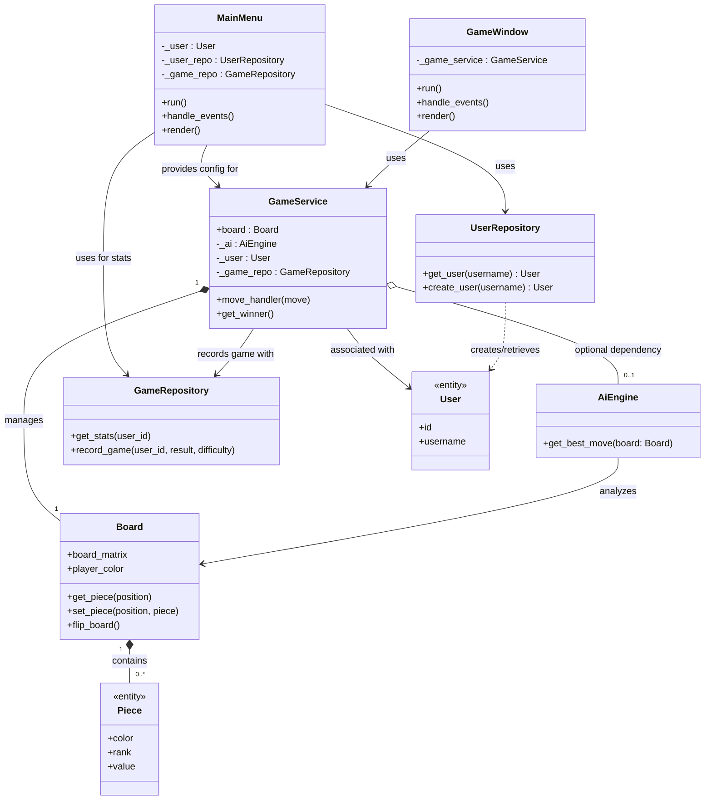
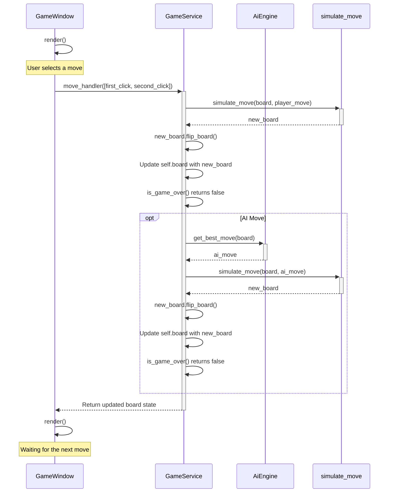

# Architecture

## High-level description
The architecture is mainly divided into three main components:
- UI
- Engine
  - Entities
  - Services
- Persistence
  - Models
  - Repositories

The main.py file serves as the entry point for the program as well as a coordinator of the three different components. It initiates MainMenu and passes the game setting info it receives from there to the GameService. The GameService itself is passed to the UI level's GameWindow. From there on, the window sends board moves to the GameService, which returns a board to the GameWindow for rendering. 

Within the Engine, the GameService is central. It manages the game state, which is represented by Entities like the Board and Piece objects. When processing moves, GameService utilizes other Services within the Engine, such as the AIEngine (if playing against an AI) and the core chess logic functions (for validating moves, simulating them, detecting checks, and generating possible moves). These core functions operate directly on the Board entity.

The Persistence layer handles saving and loading data. The MainMenu uses Repositories (UserRepository and GameRepository) to fetch user information and display statistics, or to create new users. Similarly, after a game concludes, the GameService can use a GameRepository to record the game's outcome. 

### Program arcitechture
Here is a highly abstracted class diagram for the entire chess engine:

## Turn sequence diagram
Here is a high-level sequence diagram for the actions taken after a player selects a move in the game window (and when the player's color is white). The player's color and whether they play against AI or another player is dictated by the config received from the main menu. The "AI Move" branch only triggers if the player is playing against AI.

