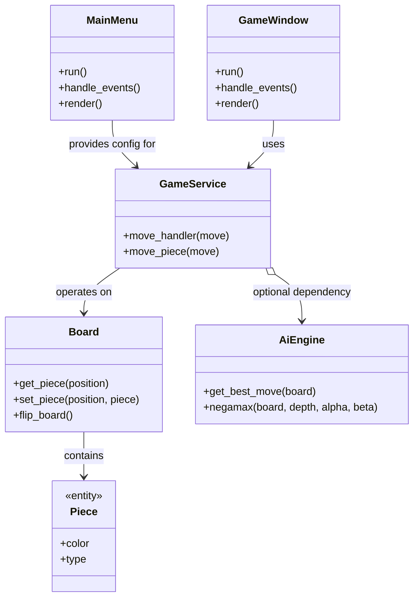

# Architecture

```mermaid
classDiagram
    %% Main UI components
    class MainMenu {
      +run()
      +handle_events()
      +render()
    }
    class GameWindow {
      +run()
      +handle_events()
      +render()
    }

    %% Core game logic/service
    class GameService {
      +move_handler(move)
      +move_piece(move)
    }

    %% Game entities
    class Board {
      +get_piece(position)
      +set_piece(position, piece)
      +flip_board()
    }
    class Piece {
      <<entity>>
      +color
      +type
    }

    %% AI engine
    class AiEngine {
      +get_best_move(board)
      +negamax(board, depth, alpha, beta)
    }

    %% Relationships
    MainMenu --> GameService : provides config for
    GameWindow --> GameService : uses
    GameService --> Board : operates on
    Board --> Piece : contains
    GameService o--> AiEngine : optional dependency

```
