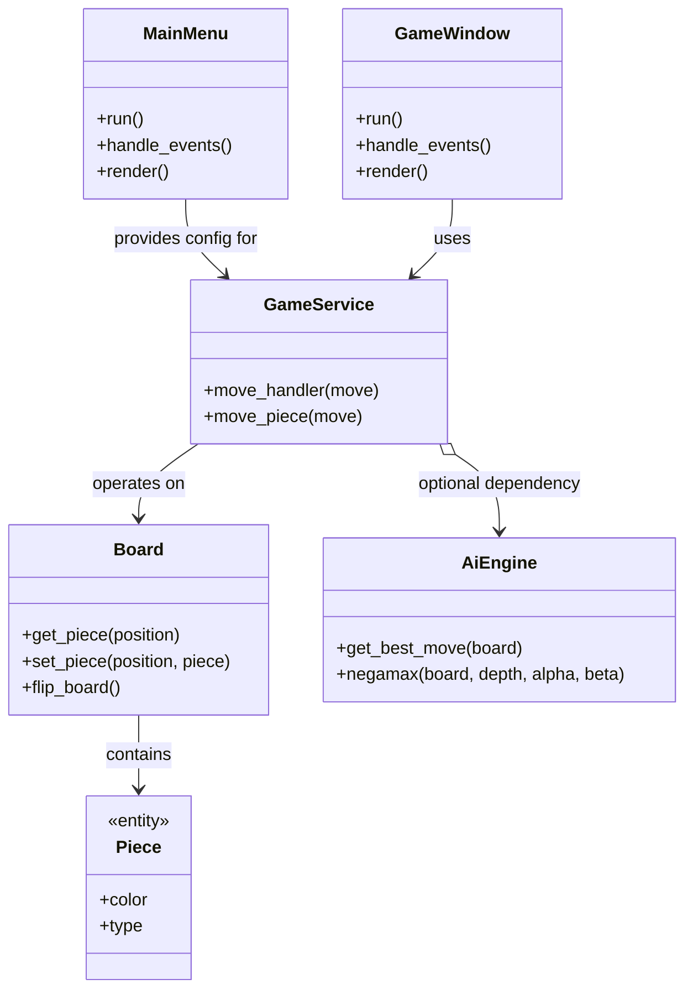
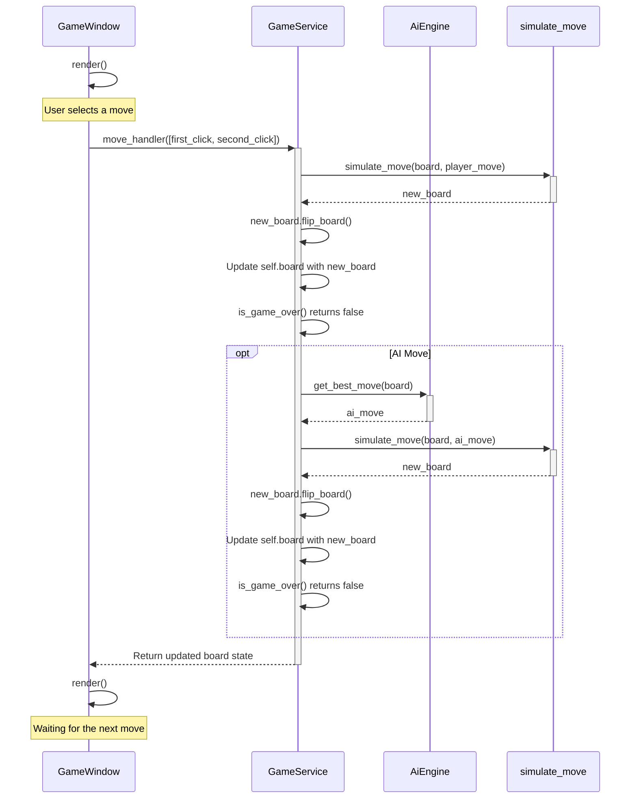

# Architecture

This is a general, high-level class diagram for the chess engine:

Here is a high-level sequence diagram for the actions taken after a player selects a move in the game window (and when the player's color is white). The player's color and whether they play against AI or another player is dictated by the config received from the main menu. The "AI Move" branch only triggers if the player is playing against AI.

