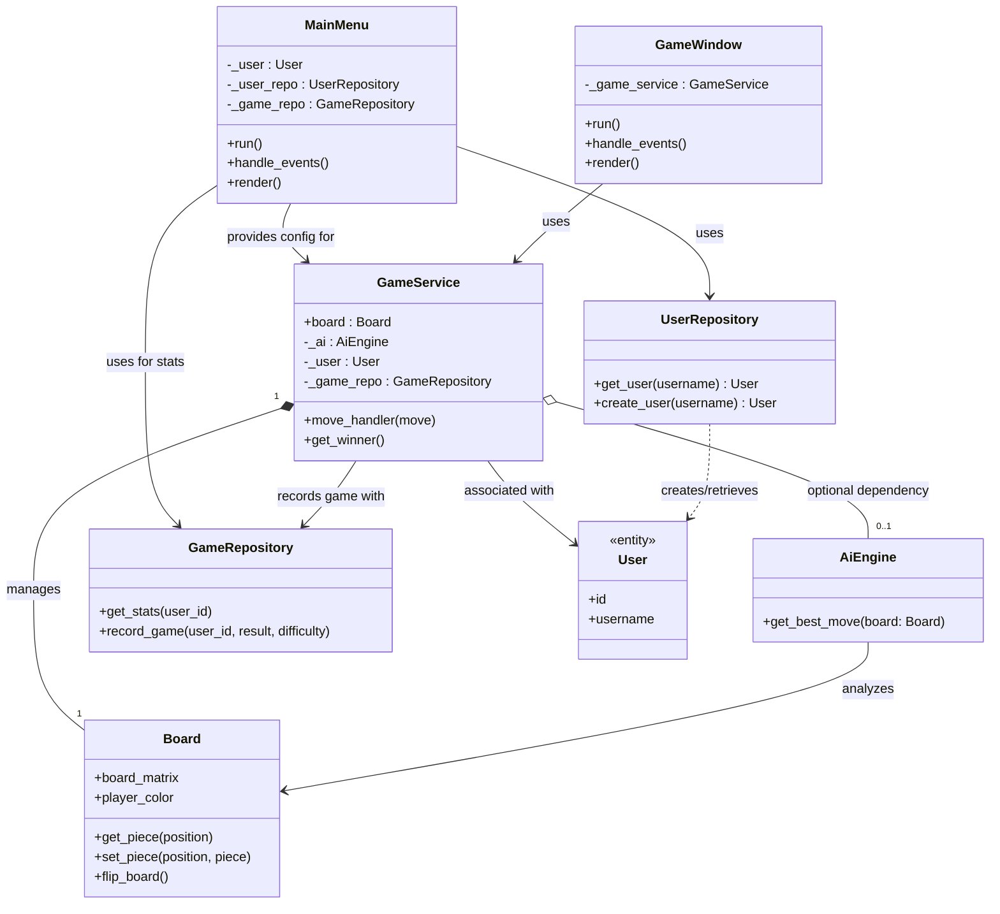
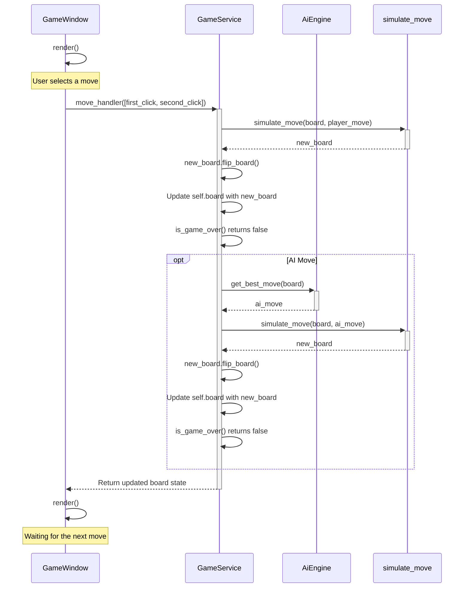

# Implementation

## High-level description

The architecture is mainly divided into three main components:

- UI
- Engine
  - Entities
  - Services
- Persistence
  - Models
  - Repositories

The main.py file serves as the entry point for the program as well as a coordinator of the three different components. It initiates MainMenu and passes the game setting info it receives from there to the GameService. The GameService itself is passed to the UI level's GameWindow. From there on, the window sends board moves to the GameService, which returns a board to the GameWindow for rendering.

Within the Engine, the GameService is central. It manages the game state, which is represented by the Board Entity. When processing moves, GameService utilizes other Services within the Engine, such as the AIEngine (if playing against an AI) and the core chess logic functions (for validating moves, simulating them, detecting checks, and generating possible moves). These core functions operate directly on the Board entity.

The Persistence layer handles saving and loading data. The MainMenu uses Repositories (UserRepository and GameRepository) to fetch user information and display statistics, as well as to create new users. Similarly, after a game concludes, the GameService can use a GameRepository to record the game's outcome.

### Program architecture

Here is a highly abstracted class diagram for the entire chess engine:

## Turn sequence diagram

Here is a high-level sequence diagram for the actions taken after a player selects a move in the game window (and when the player's color is white). The player's color and whether they play against AI or another player are dictated by the config received from the main menu. The "AI Move" branch only triggers if the player is playing against AI.

## Game AI

### Flow

The AI engine follows this high-level decision-making process:

1. **Move Generation**: Generate all legal moves for the current position using the move generator
2. **Move Filtering**: Filter out moves that would leave the AI's own king in check
3. **Iterative Deepening**: Start with depth 1 and incrementally increase search depth until either the minimum depth is reached or the time limit is exceeded. The minimum depth is prioritized and will always be reached, even if time runs out
4. **Move Evaluation**: For each valid move, simulate the position and evaluate using negamax with alpha-beta pruning
5. **Move Ordering**: Sort moves by their evaluation scores to improve pruning efficiency in the following iterations
6. **Best Move Selection**: Return the move with the highest evaluation score from the deepest completed search

### Algorithms

The AI employs the following algorithms:

- **Negamax with Alpha-Beta Pruning**: A minimax variant that treats both players symmetrically. Uses alpha-beta pruning to eliminate branches that cannot improve the current best score
- **Iterative Deepening**: Progressively searches at increasing depths, allowing the AI to improve its analysis until a time limit is reached. Also improves alpha-beta pruning since earlier best moves are more likely to still be good moves at deeper depths
- **Transposition Tables**: Caches previously evaluated positions and best moves to avoid redundant calculations and improve alpha-beta pruning. Stores the evaluation score, search depth, value type (exact, upper bound, lower bound), and best move for each position
- **Quiescence Search**: Extends search beyond the depth limit to evaluate only capturing moves and checks, preventing the horizon effect where the AI cant reach the final outcome of capture chains. Uses delta pruning to skip captures that cannot improve the position enough to matter
- **Null Window Search**: After evaluating the first move at each node, the following moves are searched with a minimal window (alpha, alpha+1) to quickly verify they're not better. If a move exceeds this window, it's re-searched with the full window

The AI is also optimized using move ordering, prioritizing capturing moves over quiet moves, and using previously found best moves from the transposition tables to improve alpha-beta pruning effectiveness.

### Time Complexity

The base minimax algorithm has a time complexity of **O(b^d)**, where `b` is the average branching factor (number of legal moves per position) and `d` is the search depth. In chess, the average branching factor is approximately 35, making an unoptimized search highly expensive. However, the implemented optimizations dramatically improve this complexity. Alpha-beta pruning is the most significant optimization, reducing the complexity to approximately **O(b^(d/2))** in the best case when moves are perfectly ordered, and **O(b^(3d/4))** in typical scenarios with good move ordering. This allows the AI to search roughly twice as deep in the same amount of time. Transposition tables further cut a substantial portion of the search tree by caching previously evaluated positions.

### Heuristics

The board evaluation combines both material and positional values for assessment:

**Material Values**: pawn=100, knight=320, bishop=330, rook=510, queen=975, king=0 (irrelevant)

**Positional Tables**: Each piece type has a heatmap for favored and penalized positions:

- **Pawns**: Higher values for central squares and advancing, lower values for needlessly reducing king cover
- **Knights**: Higher values for central squares, lower values for edges and corners
- **Bishops**: Higher values for central diagonals and active positions
- **Rooks**: Higher values for controlling open files and seventh rank
- **Queens**: Slightly higher values for central positions with emphasis on mobility
- **Kings**: Values vary by game phase: defensive in early-/middlegame, active in endgame

**Special Conditions**:

- **Endgame Detection**: Switches to endgame king tables when total material drops below 2200 centipawns
- **Stalemate Avoidance**: Returns neutral evaluation when the 50-move rule approaches to avoid drawn positions

## Sources
I did not have a clear singular source, but I did find the [Chess Programming WIKI](https://www.chessprogramming.org/Main_Page) quite useful when first delving into a new algorithm or optimization.

### AI use
I found AI useful for bug hunting and building understanding on how certain algorithms were supposed to work. It also provided high-quality pseudo code when prompted, but the actual code was written by me. AI was also useful for getting back into the project, as when I started, there had been multiple months since I last developed this Chess engine. AI was also used for improving grammar in the documentation.