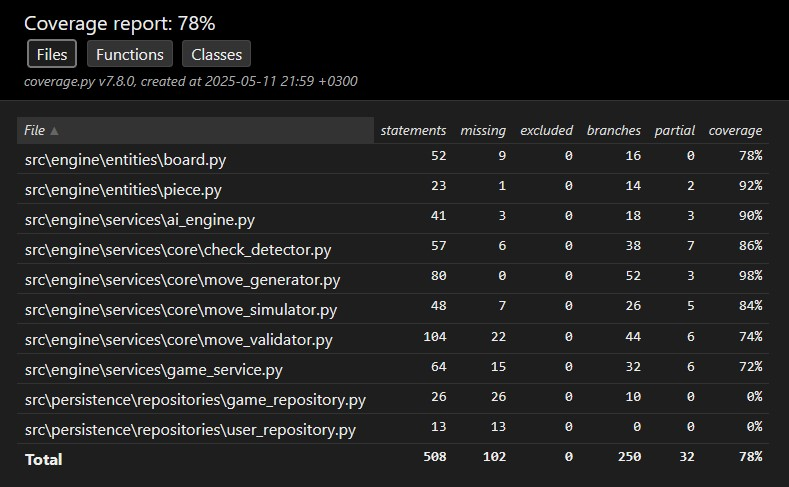

# Testing
The application has automated testing and has been manually verified to work on both Windows 10 and Ubuntu operating systems.

## Automated testing
### Application logic
The main application logic is mostly tested by a single TestPawn class, which attempts various different pawn-related moves and ensures illegal moves are not allowed. We do not need to check each piece type separately, as we are mainly focused on testing if the application logic chain is intact with these tests. The higher-level logic flow does not change significantly regardless of which piece has been moved. 

In addition to general game logic testing, there are separate tests for verifying that only legal moves can be made during check, as well as testing some of the game's end states. The AI engine also has tests to ensure it can find and force a mate-in-two from a given position. 

### Test coverage
The test coverage for the application logic currently stands at 84%.

The repositories are not included in the automated testing due to their simple logic.

## System testing
The application has been manually tested to work on both Windows 10 and Ubuntu systems. The given commands and installation 
Instructions found in the [user manual](https://github.com/JuhoTurunen/chess-app/blob/main/documentation/user_manual.md) are not
system-specific and work with either operating system.

Each feature in the [requirements specification](https://github.com/JuhoTurunen/chess-app/blob/main/documentation/requirements_specification.md)
document has been verified to work on both operating systems.

## Testing limitations
Currently, the database repositories and initialization are not covered by automated testing. This is due to the small complexity of said database and the logic related to it. Though the database has been thoroughly manually tested. 
